# Знакомство с C#.
## ЧТО ТАКОЕ .NET?
.NET — это революционная программная среда, созданная Microsoft для разработки компьютерных программ. Для начала отметим, что .NET предоставляет больше, чем просто средства для создания программ, предназначенных для операционной системы Windows. .NET имеет полностью открытый исходный код и полностью поддерживает кроссплатформенность. Кроссплатформенность означает, что код, который вы пишете с использованием .NET, будет работать также в операционных системах Linux и MacOS. Исходный код .NET имеет открытый исходный код, и вы можете найти его по адресу github.com/dotnet/core.

Программная среда .NET состоит из предварительно написанного компьютерного кода, который обеспечивает простой доступ к основным вычислительным ресурсам, таким как жесткий диск и память компьютера. Один из аспектов этой структуры называется библиотекой базовых классов (BCL), которая содержит класс System. Вы познакомитесь с ним по мере чтения этой книги. Более глубоко изучив исходный код внутри класса System, вы обнаружите, что он включает определения таких типов данных, как строки, целые числа, логические значения и символы. Если вам нужен один из этих типов данных в вашей программе для хранения информации, вы можете использовать для этого уже написанный код .NET. Если бы такого кода еще не существовало, вам пришлось бы использовать языки программирования низкого уровня, такие как ассемблер или машинный код, чтобы самостоятельно распределять и управлять необходимой памятью. Базовые типы, обнаруженные в классе System, также облегчают взаимодействие между языками программирования .NET — концепция, называемая системой общих типов (CTS). Совместимость означает, что строка в C# имеет те же атрибуты и поведение, что и строка в Visual Basic или F#. Помимо библиотеки исходного кода, .NET также включает среду Common Language Runtime (CLR), которая отвечает за выполнение всех приложений, разработанных с использованием библиотеки .NET; подробнее об этом позже.
Помимо класса System, .NET содержит множество других классов, часто называемых модулями. Кто-то скажет, что это гигантская библиотека кода объектно-ориентированного программирования (ООП), разбитая на различные модули — вы используете ее части в зависимости от результатов, которых хотите достичь. Например, System.IO и System.Text — это классы, которые вы можете использовать для чтения и записи файлов, расположенных на жестком диске компьютера. Программист может манипулировать содержимым файла, просто используя код, который уже существует в классе System.IO, без необходимости управлять дескрипторами или загружать файл с жесткого диска в память. В .NET существует множество классов, которые помогают программистам писать программы в быстром темпе, поскольку весь низкоуровневый код, необходимый для выполнения их задач, уже написан. Программисту нужно только знать, какие классы ему необходимы для достижения целей программы.
.NET не только ускоряет разработку приложений, но и может использоваться многими другими языками программирования, а не только C# (которому посвящена эта книга). Программы, написанные на C++, F#, Visual Basic и даже более старых языках, таких как COBOL, могут использовать классы, существующие в .NET. Эти языки имеют доступ к коду библиотеки .NET, но код, написанный на одном языке программирования, может взаимодействовать с кодом другого. Например, программа, написанная на C#, может использовать код, написанный на Visual Basic или F#, и наоборот. Все эти примеры делают .NET такой привлекательной перспективой для создания индивидуального программного обеспечения.
## .NET Framework, .NET Standard и .NET Core
Когда изначально была создана .NET Framework, она была ориентирована на платформу операционной системы Windows. С течением времени код .NET Framework был разветвлен для поддержки множества других платформ, таких как устройства IoT, настольные компьютеры, мобильные устройства и другие операционные системы. Некоторые из ветвей вы можете узнать по именам .NET Compact Framework, .NET Portable или .NET Micro Framework. Каждая из этих вилок содержала свой собственный, слегка модифицированный BCL. Обратите внимание, что BCL — это больше, чем просто строки, логические значения и целые числа. Он включает в себя такие возможности, как доступ к файлам, манипулирование строками, управление потоками, хранение данных в коллекциях, атрибуты безопасности и многие другие.
Наличие даже немного отличающегося BCL требовало от программиста изучения, разработки и управления тонкими различиями между BCL для каждого ответвления .NET. Каждый ответвление .NET Framework, ориентированное на настольные компьютеры, Интернет или мобильные платформы, может иметь существенные различия в реализации, даже если каждая программа использует .NET. Для компании было (и до сих пор) очень распространено иметь приложения для настольных компьютеров, веб-сайтов и телефонов, которые выполняли одну и ту же программную логику, но работали на разных платформах. В этом сценарии для использования .NET требовалась версия приложения компании для каждой платформы. Это было неэффективно. Эту проблему решил .NET Standard. Стандарт .NET предоставил программистам возможность создавать логику приложения, которую можно было использовать в любом из ответвлений .NET Framework. Стандарт .NET сделал различные платформы, такие как настольные, мобильные и веб-версии, независимыми от BCL, отделив программную логику компании от зависимостей, специфичных для платформы.
.NET Core представляла собой кроссплатформенную версию библиотеки .NET с открытым исходным кодом. Эту развилку кода можно использовать для создания программ, предназначенных для множества различных платформ и операционных систем, таких как Linux, MacOS и, конечно же, Windows. Это также было ответвление, которое в конечном итоге стало единственной поддерживаемой ветвью библиотеки исходного кода .NET. С 2020 года знания о .NET Framework, .NET Standard и .NET Core уже не так актуальны, как раньше. Эти три ветви .NET необходимо упомянуть здесь, потому что вы, скорее всего, будете их видеть, читать о них и сталкиваться с ними еще несколько лет. Важно, чтобы вы знали, что они собой представляют и их назначение, на случай, если вам понадобится работать над проектом, который их реализует. С 2020 года появится новая версия .NET, названная просто «.NET». .NET имеет полностью открытый исходный код, полностью кроссплатформен и может использоваться на многих платформах без необходимости поддерживать несколько версий, ветвей и ветвей вашей программы.
## Написание программ с использованием .NET
Создание компьютерной программы с помощью .NET означает написание кода, использующего существующий код, найденный в библиотеке .NET. В этой книге вы используете Visual Studio для разработки своих программ. Visual Studio — это мощная интегрированная среда разработки, поддерживающая C# (а также C++, Visual Basic, F# и некоторые другие). Преимущество этой среды — простота, с которой функции .NET можно интегрировать в ваш код. Создаваемый вами код будет полностью написан на C#, но везде будет использоваться .NET, а также, при необходимости, некоторые дополнительные инструменты Visual Studio. Для выполнения кода C# его необходимо преобразовать в язык, понятный целевой операционной системе, известный как собственный код. Это преобразование называется компиляцией, действие, выполняемое компилятором и представляющее собой двухэтапный процесс.
## CIL и JIT
Когда вы компилируете код, использующий .NET, вы не сразу создаете собственный код, специфичный для операционной системы. Вместо этого вы компилируете свой код в код Common Intermediate Language (CIL). Этот код не относится ни к одной операционной системе (ОС), ни к C#. Другие языки .NET — например, Visual Basic .NET или F# — также на первом этапе компилируются в этот язык. Этот этап компиляции выполняется Visual Studio при разработке приложений C#.
Очевидно, что для выполнения приложения необходимо больше работы. Это задача JIT-компилятора, который компилирует CIL в собственный код, специфичный для целевой ОС и машинной архитектуры. Только на этом этапе ОС может выполнить приложение. Часть имени «точно в срок» отражает тот факт, что код CIL компилируется только тогда, когда это необходимо. Эта компиляция может происходить на лету, пока ваше приложение работает, хотя, к счастью, вам как разработчику обычно об этом не стоит беспокоиться. Если вы не пишете чрезвычайно сложный код, где производительность имеет решающее значение, достаточно знать, что этот процесс компиляции будет весело работать в фоновом режиме, не вмешиваясь.
Раньше часто приходилось скомпилировать код в несколько приложений, каждое из которых ориентировано на определенную операционную систему и архитектуру ЦП. Обычно это была форма оптимизации (например, чтобы заставить код работать быстрее на чипсете AMD), но иногда это было критически важно (например, чтобы приложения работали как в средах Win9x, так и в средах WinNT/2000). Теперь в этом нет необходимости, поскольку JIT-компиляторы (как следует из их названия) используют код CIL, который не зависит от машины, операционной системы и процессора. Существует несколько JIT-компиляторов, каждый из которых ориентирован на свою архитектуру, и CLR использует соответствующий компилятор для создания необходимого собственного кода.
Прелесть всего этого в том, что с вашей стороны требуется гораздо меньше работы — фактически вы можете забыть о системно-зависимых деталях и сконцентрироваться на более интересных функциях вашего кода.

> **ПРИМЕЧАНИЕ.**  Изучая .NET, вы можете встретить ссылки на Microsoft Intermediate Language (MSIL). MSIL было первоначальным названием CIL, и многие разработчики до сих пор используют эту терминологию. См. en.wikipedia.org/wiki/Common_Intermediate_Language для получения дополнительной информации о CIL (также известном как промежуточный язык [IL]).

## Сборки
При компиляции приложения код CIL сохраняется в сборке. Сборки включают как исполняемые файлы приложений, которые можно запускать непосредственно из Windows без необходимости использования каких-либо других программ (они имеют расширение файла .exe), так и библиотеки (которые имеют расширение .dll) для использования другими приложениями.
Помимо содержания CIL, сборки также включают метаинформацию (то есть информацию об информации, содержащейся в сборке, также известную как метаданные) и дополнительные ресурсы (дополнительные данные, используемые CIL, такие как звуковые файлы и изображения). Метаинформация позволяет сборкам быть полностью самоописательными. Для использования сборки вам не нужна другая информация, а это означает, что вы избегаете таких ситуаций, как невозможность добавления необходимых данных в системный реестр и т. д., что часто было проблемой при разработке на других платформах.
Это означает, что развертывание приложений зачастую так же просто, как копирование файлов в каталог на удаленном компьютере. Поскольку никакой дополнительной информации о целевых системах не требуется, вы можете просто запустить исполняемый файл из этого каталога, и, предполагая, что CLR установлена ​​для целевых приложений .NET, все готово. В зависимости от сценария развертывания модули, необходимые для запуска программы, включены в пакет развертывания, что означает отсутствие дополнительных настроек.
С точки зрения .NET вам необязательно размещать все необходимое для запуска приложения в одном каталоге. Вы можете написать код, выполняющий задачи, необходимые нескольким приложениям. В подобных ситуациях часто бывает полезно разместить повторно используемый код в месте, доступном для всех приложений. В .NET это место — глобальный кэш сборок (GAC). Разместить код в GAC просто — вы просто помещаете сборку, содержащую код, в каталог, содержащий этот кэш.
## Управляемый код
Роль CLR не заканчивается после того, как вы скомпилировали свой код в CIL, а JIT-компилятор скомпилировал его в собственный код. Код, написанный с использованием .NET, управляется во время его выполнения (этап, обычно называемый временем выполнения). Это означает, что CLR заботится о ваших приложениях, управляя памятью, обеспечивая безопасность, обеспечивая межъязыковую отладку и т. д. Напротив, приложения, которые не выполняются под управлением CLR, считаются неуправляемыми, и некоторые языки, такие как C++, могут использоваться для написания таких приложений, которые, например, получают доступ к низкоуровневым функциям операционной системы. Однако на C# можно писать только код, который выполняется в управляемой среде. Вы будете использовать управляемые функции CLR и позволите .NET самой обрабатывать любое взаимодействие с операционной системой.
## Сбор мусора
Одной из наиболее важных особенностей управляемого кода является концепция сборки мусора. Это метод .NET, обеспечивающий полное освобождение памяти, используемой приложением, когда приложение больше ее не использует. До появления .NET за это в основном отвечали программисты, и несколько простых ошибок в коде могли привести к загадочному исчезновению больших блоков памяти из-за их выделения в неправильном месте памяти. Обычно это означало постепенное замедление работы вашего компьютера с последующим сбоем системы.
Сбор мусора .NET работает путем периодической проверки памяти вашего компьютера и удаления из нее всего ненужного. Для этого не существует установленных временных рамок; это может происходить тысячи раз в секунду, раз в несколько секунд или когда угодно, но вы можете быть уверены, что это произойдет.
Здесь есть некоторые последствия для программистов. Поскольку эта работа выполняется за вас в непредсказуемое время, приложения должны разрабатываться с учетом этого. Код, для выполнения которого требуется много памяти, должен привести себя в порядок, а не ждать, пока произойдет сбор мусора, но это не так сложно, как кажется.
## Собираем все вместе
Прежде чем двигаться дальше, давайте суммируем шаги, необходимые для создания приложения .NET, как обсуждалось ранее:
1. Код приложения написан с использованием .NET-совместимого языка, такого как C#.
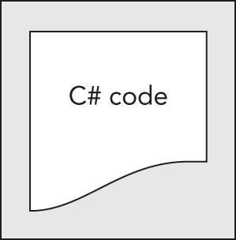
2. Этот код компилируется в CIL, который хранится в сборке.
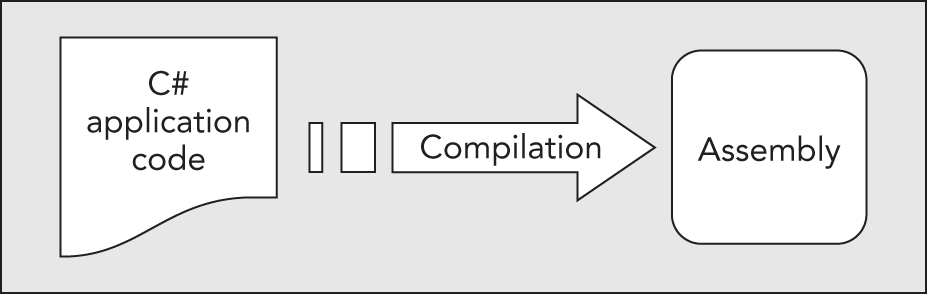
3. Когда этот код выполняется (либо сам по себе, если это исполняемый файл, либо когда он используется из другого кода), его необходимо сначала скомпилировать в собственный код с помощью JIT-компилятора.
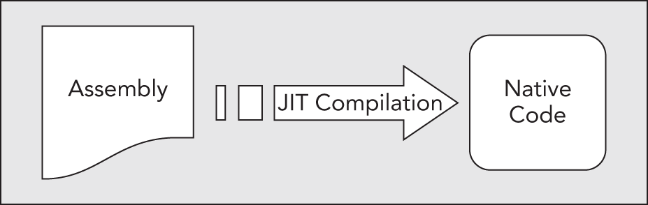
4. Собственный код выполняется в контексте управляемой среды CLR вместе с любыми другими запущенными приложениями или процессами.
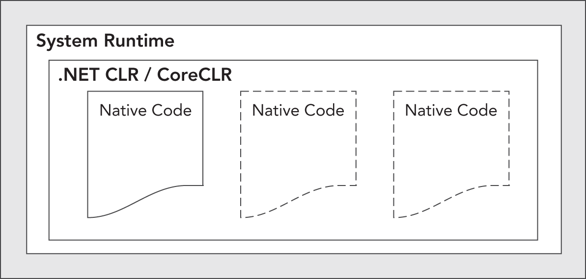
Обратите внимание на еще один момент, касающийся этого процесса. Код C#, который компилируется в CIL на шаге 2, не обязательно должен содержаться в одном файле. Код приложения можно разделить на несколько файлов исходного кода, которые затем компилируются в одну сборку. Этот чрезвычайно полезный процесс известен как связывание. Это необходимо, поскольку гораздо проще работать с несколькими файлами меньшего размера, чем с одним огромным. Вы можете разделить логически связанный код в отдельный файл, чтобы над ним можно было работать независимо, а после завершения о нем практически забыть. Это также упрощает поиск конкретных фрагментов кода, когда они вам нужны, и позволяет группам разработчиков разделить нагрузку по программированию на управляемые фрагменты. Это позволяет людям «проверять» фрагменты кода для работы, не рискуя повредить удовлетворительные в других отношениях разделы или разделы, над которыми работают другие люди.

## ЧТО ТАКОЕ С#?
C#, как упоминалось ранее, является одним из языков, которые можно использовать для создания приложений, которые будут работать в .NET CLR. Это развитие языков C и C++, созданное Microsoft специально для работы с платформой .NET. Язык C# был разработан с учетом многих лучших функций других языков и устранения их проблем.
Разрабатывать приложения с использованием C# проще, чем с использованием C++, поскольку синтаксис языка проще. Тем не менее, C# — мощный язык, и на C++ мало что можно сделать такого, чего нельзя было бы сделать на C#. При этом те функции C#, которые параллельны более продвинутым функциям C++, например прямой доступ к системной памяти и управление ею, могут быть реализованы только с использованием кода, помеченного как небезопасный. Этот продвинутый программный метод потенциально опасен (отсюда и его название), поскольку можно перезаписать критически важные для системы блоки памяти с потенциально катастрофическими результатами. По этой и другим причинам данная книга не рассматривает эту тему.
Иногда код C# оказывается немного более многословным, чем C++. Это следствие того, что C# является типобезопасным языком (в отличие от C++). С точки зрения непрофессионала это означает, что после того, как некоторые данные были присвоены типу, они не могут впоследствии преобразоваться в другой несвязанный тип. Следовательно, при преобразовании между типами необходимо соблюдать строгие правила, а это означает, что вам часто придется писать больше кода для выполнения одной и той же задачи на C#, чем вы могли бы написать на C++. Однако в этом есть свои преимущества: код становится более надежным, отладка проще, а .NET всегда может отслеживать тип фрагмента данных в любое время. Поэтому в C# вы, возможно, не сможете делать такие вещи, как «взять в эти данные область памяти размером 4 байта и длиной 10 байт и интерпретировать ее как X», но это не обязательно плохо.
C# — это лишь один из языков, доступных для разработки .NET, но он, безусловно, лучший. Его преимущество состоит в том, что он является единственным языком, разработанным с нуля для .NET, и является основным языком, используемым в версиях .NET, перенесенных на другие операционные системы. Чтобы сохранить такие языки, как версия Visual Basic для .NET, максимально похожими на их предшественников, но при этом совместимыми со CLR, некоторые функции библиотеки кода .NET не поддерживаются полностью или, по крайней мере, требуют необычного синтаксиса.
Напротив, C# может использовать все функции, которые может предложить библиотека кода .NET. Кроме того, каждая новая версия .NET включает дополнения к языку C#, частично в ответ на запросы разработчиков, что делает его еще более мощным.

## Приложения, которые можно написать на C#
.NET не имеет ограничений на типы возможных приложений. C# использует эту платформу и поэтому не имеет ограничений на возможные приложения. Однако вот несколько наиболее распространенных типов приложений:

**Настольные приложения** — приложения, такие как Microsoft Office, которые имеют знакомый внешний вид и функции Windows. Это упрощается с помощью модуля Windows Presentation Foundation (WPF) .NET, который представляет собой библиотеку элементов управления (таких как кнопки, панели инструментов, меню и т. д.), которые можно использовать для создания пользовательского интерфейса Windows (UI).

**Облачные/веб-приложения.** .NET включает в себя мощную систему под названием ASP.NET Core для динамического создания веб-контента, обеспечения персонализации, безопасности и многого другого. Кроме того, эти приложения можно размещать и получать к ним доступ в облаке, например, на платформе Microsoft Azure.

**Мобильные приложения.** 
Используя C# и платформу мобильного пользовательского интерфейса Xamarin, вы можете ориентировать мобильные приложения, предназначенные для операционной системы Android.

**Веб-API** — идеальная платформа для создания HTTP-сервисов RESTful, поддерживающих широкий спектр клиентов, включая мобильные устройства и браузеры. Их также называют REST API.

**Службы WCF** — способ создания универсальных распределенных приложений. С помощью WCF вы можете обмениваться практически любыми данными через локальные сети или Интернет, используя один и тот же простой синтаксис, независимо от языка, используемого для создания службы или системы, в которой она находится. Это старая технология, для создания которой потребуется более старая версия .NET Framework.

Любому из этих типов приложений может также потребоваться та или иная форма доступа к базе данных, чего можно добиться с помощью набора функций ADO.NET (Active Data Objects .NET) .NET, через Entity Framework или через LINQ (Language Integrated Query) возможности C#. Можно использовать множество других сборок ресурсов, которые полезны при создании сетевых компонентов, выводе графики, выполнении сложных математических задач и т. д.

## VISUAL STUDIO
В этой книге вы будете использовать самую последнюю версию инструмента разработки Visual Studio для всего программирования на C# — от простых приложений командной строки до более сложных типов проектов. Инструмент разработки, или интегрированная среда разработки (IDE), такой как Visual Studio, не является обязательным для разработки приложений C#, но он значительно упрощает задачу. Вы можете (если хотите) манипулировать файлами исходного кода C# в простом текстовом редакторе, таком как вездесущее приложение «Блокнот», и компилировать код в сборки с помощью компилятора командной строки, который является частью .NET. Однако зачем это делать, если у вас есть возможность помочь вам в IDE?
### Продукты Visual Studio
Microsoft предоставляет несколько версий Visual Studio. Например:

**Visual Studio Community**

**Visual Studio Professional**

**Visual Studio Enterprise** 

**Visual Studio Code**

**Visual Studio for Mac**

Visual Studio Code, Mac и Community доступны бесплатно по адресу [http://visualstudio.microsoft.com/downloads](http://visualstudio.microsoft.com/downloads) . Версии Professional и Enterprise имеют дополнительные возможности, за которые приходится платить.
Различные продукты Visual Studio позволяют создавать практически любое приложение C#, которое вам может понадобиться. Visual Studio Code — это простой, но надежный редактор кода, работающий в Windows, Linux и iOS.

Visual Studio Community, в отличие от Visual Studio Code, сохраняет тот же внешний вид, что и Visual Studio Professional и Enterprise. Microsoft предлагает в Visual Studio Community многие из тех же функций, которые существуют в версиях Professional и Enterprise; однако некоторые примечательные функции отсутствуют, такие как возможности глубокой отладки и инструменты оптимизации кода. Однако не так уж много функций отсутствует, чтобы вы не могли использовать Community для работы по главам этой книги. Visual Studio Community — это версия IDE, используемая для работы с примерами в этой книге.

## Решения (Solutions)
Когда вы используете Visual Studio для разработки приложений, вы делаете это путем создания решений. Решение, с точки зрения Visual Studio, — это больше, чем просто приложение. Решения содержат проекты, которые могут быть консольными приложениями, проектами WPF, проектами облачных/веб-приложений, проектами ASP.NET Core и т. д. Поскольку решения могут содержать несколько проектов, вы можете сгруппировать связанный код в одном месте, даже если в конечном итоге он будет скомпилирован в несколько сборок в разных местах вашего жесткого диска.
Это особенно полезно, поскольку позволяет работать с общим кодом (который может быть размещен в GAC) одновременно с приложениями, использующими этот код. Отладка кода намного проще, когда используется только одна среда разработки, поскольку вы можете пошагово выполнять инструкции в нескольких модулях кода.

## Примеры кода
[Github](./)

Исходные коды помещены на Github в папки с соответсвующим той лекции в которой они показаны именем.

## Visual Studio Community
Теперь, когда вы потратили некоторое время на изучение того, что такое C# и как он вписывается в .NET, пришло время испачкать руки и написать код. На протяжении всего курса вы используете сообщество Visual Studio (VS), поэтому первое, что нужно сделать, — это взглянуть на некоторые основы этой среды разработки.

Visual Studio — огромный и сложный продукт, и он может показаться сложным для начинающих пользователей, но использовать его для создания базовых приложений может быть на удивление просто. Когда вы начнете использовать Visual Studio в этой главе, вы увидите, что вам не нужно знать много о ней, чтобы начать работать с кодом C#. Далее в книге вы увидите некоторые из более сложных операций, которые может выполнять Visual Studio, но на данный момент все, что требуется, — это базовые знания работы.

После того, как вы ознакомились с IDE, вы собрали два простых приложения. На данный момент вам не нужно слишком беспокоиться о коде этих приложений; вы просто хотите доказать, что все работает. Проработав процедуры создания приложений в этих ранних примерах, они вскоре станут вашей второй натурой.
В этой лекции вы узнаете, как создавать два основных типа приложений: консольное приложение и настольное приложение.

Первое приложение, которое вы создадите, — это простое консольное приложение. Консольные приложения не используют графическую среду Windows, поэтому вам не придется беспокоиться о кнопках, меню, взаимодействии с указателем мыши и так далее. Вместо этого вы запускаете приложение в окне командной строки и взаимодействуете с ним гораздо проще.

Второе приложение — это настольное приложение, которое вы создаете с помощью Windows Presentation Foundation (WPF). Внешний вид настольного приложения очень знаком пользователям Windows, и (что удивительно) для создания приложения не требуется особых усилий. Однако синтаксис требуемого кода более сложен, хотя во многих случаях вам не нужно беспокоиться о деталях.

Далее вы используете оба типа приложений, уделяя больше внимания консольным приложениям в начале. Дополнительная гибкость настольных приложений не требуется при изучении языка C#, а простота консольных приложений позволяет вам сосредоточиться на изучении синтаксиса, не беспокоясь о внешнем виде приложения.

## Среда Visual Studio
Когда вы начнете установку Visual Studio Community, вам будет предложено открыть окно, подобное данному. 
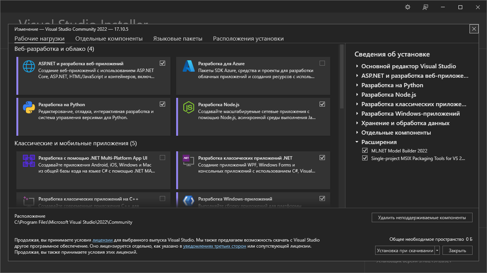 
Он предоставляет список рабочих нагрузок, отдельных компонентов и языковых пакетов для установки вместе с основным редактором.
Проверьте следующие рабочие нагрузки и нажмите кнопку «Установить»:

**ASP.NET и разработка Web приложений**

**Разработка классических приложений .NET**

**Хранение и обработка данных**

После завершения установки при первой загрузке Visual Studio вам сразу же предлагается войти в Visual Studio, используя свою учетную запись Microsoft. При этом настройки Visual Studio синхронизируются между устройствами, поэтому вам не придется настраивать IDE при ее использовании на нескольких рабочих станциях. Если у вас нет учетной записи Microsoft, следуйте инструкциям по ее созданию, а затем используйте ее для входа. Если вы не хотите входить в систему, нажмите ссылку «Не сейчас, возможно, позже» и продолжите первоначальную настройку. Visual Studio. Рекомендуется в какой-то момент вам войти в систему и получить лицензию разработчика.

Если вы запускаете Visual Studio впервые, вам будет представлен список настроек, предназначенный для пользователей, имеющих опыт работы с предыдущими выпусками этой среды разработки. Выбор, который вы здесь делаете, влияет на ряд вещей, таких как расположение окон, способ работы окон консоли и т. д. Поэтому выберите Visual C# из раскрывающегося списка; в противном случае вы можете обнаружить, что все работает не совсем так, как описано в этой книге. Обратите внимание, что доступные параметры различаются в зависимости от параметров, которые вы выбрали при установке Visual Studio, но пока вы решили установить C#, этот параметр будет доступен.

Если вы запускаете Visual Studio не в первый раз и в первый раз выбрали другой вариант, не паникуйте. Чтобы сбросить настройки Visual C#, вам просто нужно их импортировать. Для этого выберите «Инструменты» ➪ «Настройки импорта и экспорта» и выберите параметр «Сбросить все настройки», как показано на рисунке.
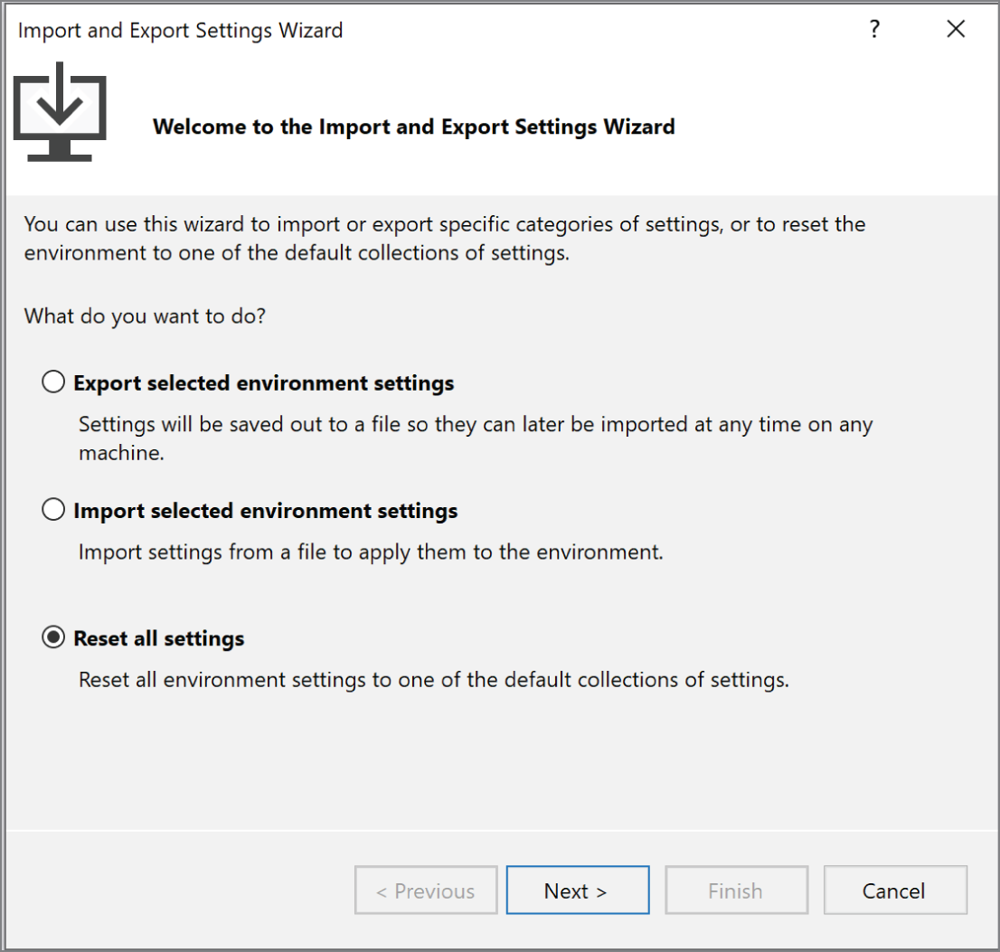
Нажмите «Далее» и укажите, хотите ли вы сохранить существующие настройки, прежде чем продолжить. Если у вас есть персонализированные вещи, возможно, вы захотите сделать это; в противном случае выберите «Нет» и еще раз нажмите «Далее». В следующем диалоговом окне выберите Visual C#, как показано на рисунке. Опять же, доступные варианты могут различаться.
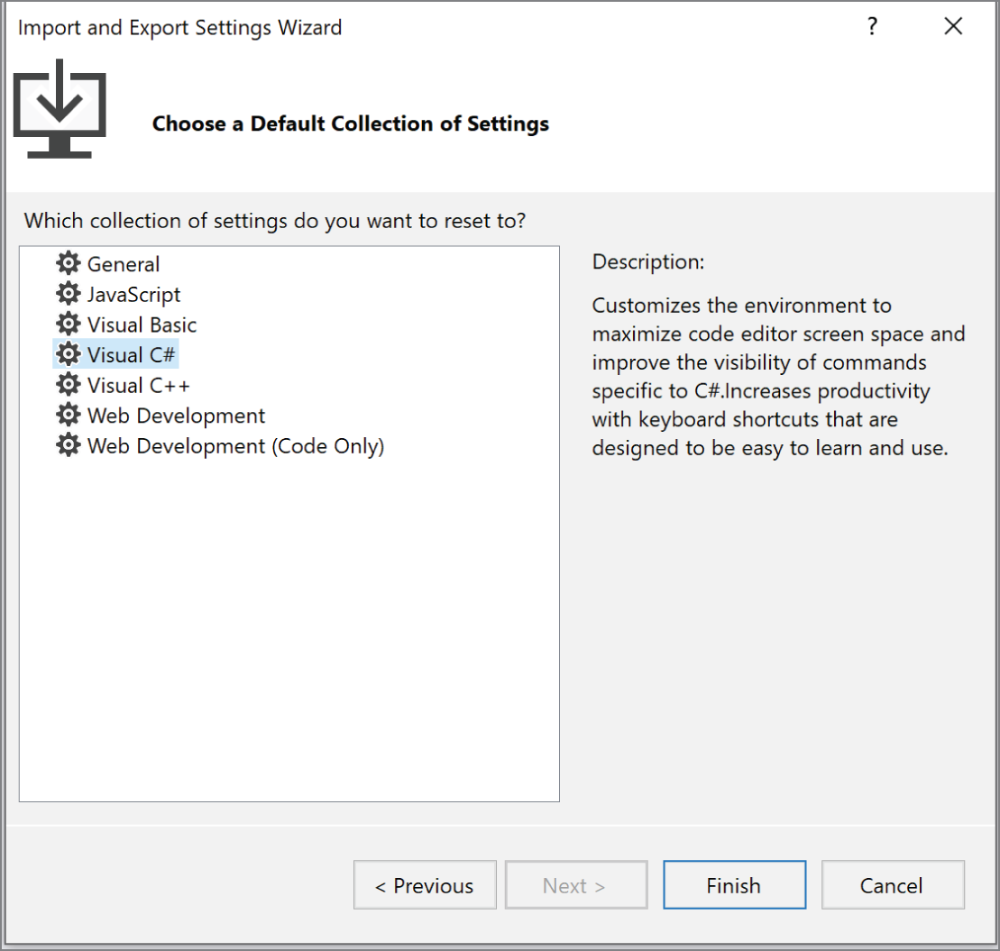
Наконец, нажмите «Готово», затем «Закрыть», чтобы применить настройки.
Макет среды Visual Studio полностью настраивается, но здесь подойдет значение по умолчанию. Если выбраны «Настройки разработчика C#», все будет организовано, как показано на рисунке
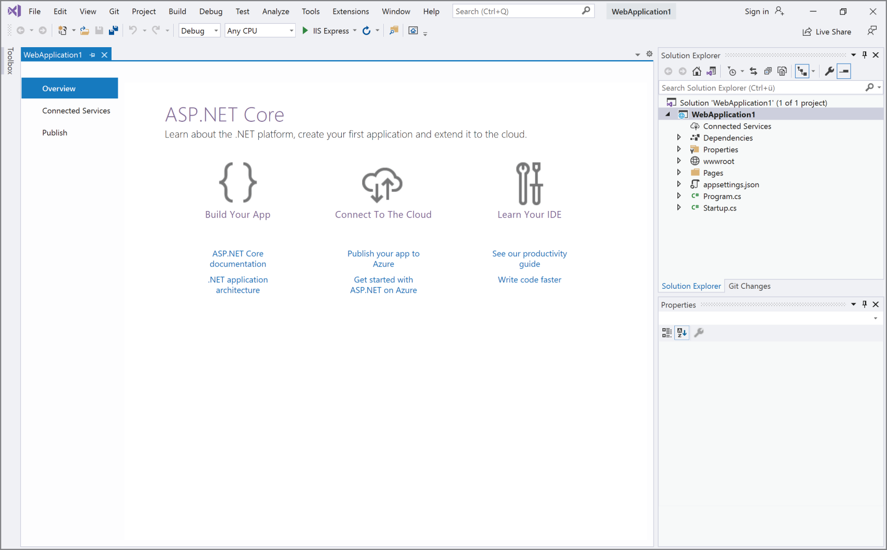

В главном окне отображается весь ваш код, и оно будет отличаться в зависимости от того, какой тип решения вы создаете. Рисунок — это базовое веб-приложение ASP.NET; на стартовой странице представлены некоторые ссылки и дополнительная информация, относящаяся к этому типу приложения. Это окно может содержать множество документов, каждый из которых обозначен вкладкой, поэтому вы можете легко переключаться между несколькими файлами, щелкая их имена. У него также есть и другие функции: он может отображать графические интерфейсы, которые вы разрабатываете для своих проектов, текстовые файлы, HTML и различные инструменты, встроенные в Visual Studio. Со всем этим вы встретитесь в ходе изучения курса.

Над главным окном расположены панели инструментов и меню Visual Studio. Здесь можно разместить несколько различных панелей инструментов с различными функциями: от сохранения и загрузки файлов до создания и запуска проектов и элементов управления отладкой. Опять же, вы знакомитесь с ними по мере необходимости их использования.

Вот краткое описание каждой из основных функций, которые вы будете использовать чаще всего:
• Окно «Панель инструментов» появляется при нажатии на его вкладку. Он обеспечивает доступ, среди прочего, к строительным блокам пользовательского интерфейса для настольных приложений. Здесь также может появиться еще одна вкладка, Обозреватель серверов (выбирается с помощью пункта меню «Вид» ➪ «Обозреватель серверов») и включает в себя различные дополнительные возможности, такие как сведения о подписке Azure, предоставление доступа к источникам данных, настройкам сервера, службам и т. д.
• В окне обозревателя решений отображается информация о загруженном в данный момент решении. Решением, как вы узнали из предыдущей главы, является терминология Visual Studio для одного или нескольких проектов вместе с их конфигурациями. В окне обозревателя решений отображаются различные представления проектов в решении, например, какие файлы они содержат и что содержится в этих файлах.
• В окне «Изменения Git» отображается информация о текущем подключении к репозиторию Git. Это дает вам доступ к контролю версий, отслеживанию ошибок, автоматизации сборки и другим функциям. Однако это сложная тема, и она не рассматривается в этой книге.
• Прямо под окном Solution Explorer вы можете отобразить окно свойств, показанное на рис. 2-4; он появляется только тогда, когда вы работаете над проектом (вы также можете переключить его отображение, используя «Вид» ➪ «Окно свойств»). В этом окне представлено более детальное представление содержимого проекта, что позволяет выполнить дополнительную настройку отдельных элементов. Например, вы можете использовать это окно, чтобы изменить внешний вид кнопки в настольном приложении.
• Также на снимке экрана не показано еще одно чрезвычайно важное окно: окно «Список ошибок», которое можно отобразить с помощью команды «Просмотр» ➪ «Список ошибок». Он показывает ошибки, предупреждения и другую информацию, связанную с проектом. Окно постоянно обновляется, хотя некоторая информация появляется только при компиляции проекта.
Может показаться, что это сложно принять, но чтобы освоиться, не потребуется много времени. Вы начинаете с создания первого из примеров проектов, который включает в себя множество только что описанных элементов Visual Studio.

> **ПРИМЕЧАНИЕ** Visual Studio способна отображать множество других окон, как информационных, так и функциональных. Многие из них могут использовать одно экранное пространство с упомянутыми здесь окнами, и вы можете переключаться между ними с помощью вкладок, закреплять их в другом месте или даже отсоединять и размещать на других дисплеях, если у вас несколько мониторов. Некоторые из этих окон будут использоваться далее в книге, и вы, вероятно, узнаете больше сами, когда будете более подробно изучать среду Visual Studio.

## КОНСОЛЬНЫЕ ПРИЛОЖЕНИЯ
В этом курсе вы регулярно используете консольные приложения, особенно в начале, поэтому в следующем разделе представлено пошаговое руководство по созданию простого приложения.

### Создание простого консольного приложения: ConsoleApp1\Program.cs
1. Создайте новый проект консольного приложения, выбрав «Файл» ➪ «Новый» ➪ «Проект», как показано на рисунке.
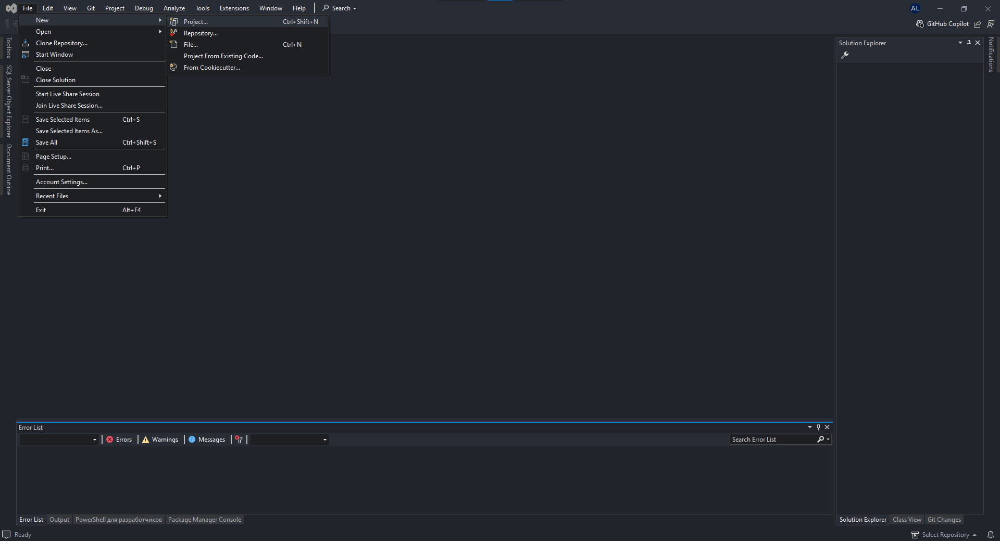

2. Убедитесь, что в раскрывающемся списке «Все языки» выбран C#, а затем выберите проект консольного приложения (см. рис.). Нажмите кнопку «Далее» и измените текстовое поле «Местоположение» на выюранное вами расположение решения (этот каталог создается автоматически, если он еще не существует). Оставьте текст по умолчанию в текстовом поле «Имя» ( ConsoleApp1 ) и другие настройки без изменений.
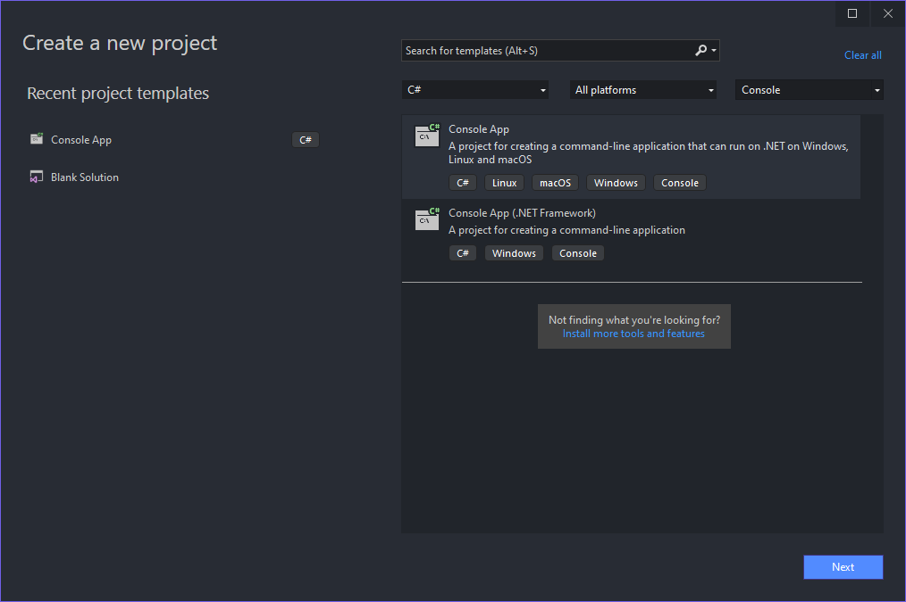
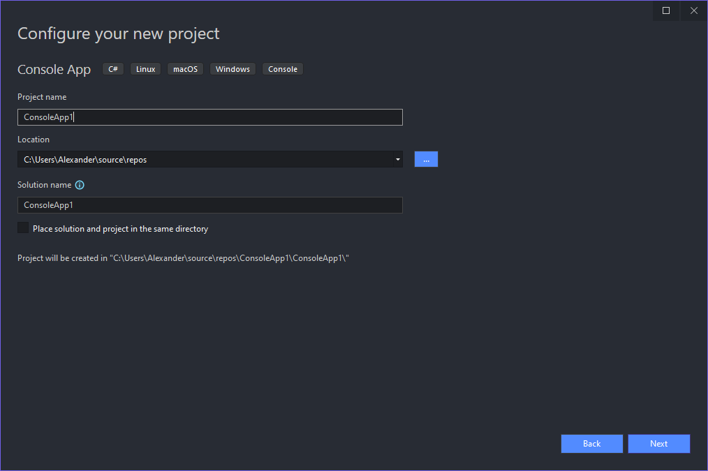

3.Выберите .NET 6.0 в раскрывающемся списке «Целевая платформа», затем нажмите кнопку «Создать».
4.После инициализации проекта добавьте следующие строки кода в файл Program.cs, отображаемый в главном окне:
```cs
Console.WriteLine("The first app in Beginning C# and .NET!");
Console.ReadKey();
```
5. Выберите пункт меню «Отладка ➪ Начать отладку». Через несколько секунд вы должны увидеть окно консоли с выводом вашего сообщения
6. Нажмите любую клавишу, чтобы выйти из приложения (возможно, вам придется сначала щелкнуть по окну консоли, чтобы сфокусироваться на нем). Экран, с выводом сообщения, появляется только в том случае, если применены настройки разработчика Visual C#, как описано ранее в этой главе. Например, если применены параметры разработчика Visual Basic, отображается пустое окно консоли, а выходные данные приложения отображаются в окне с надписью Immediate . В этом случае код Console.ReadKey() также завершается сбоем, и вы видите ошибку. Если вы столкнулись с этой проблемой, лучшее решение для работы с примерами в этой книге — применить настройки разработчика Visual C# — таким образом, результаты, которые вы увидите, будут соответствовать результатам, показанным здесь.

## Как это работает
На данный момент я не буду анализировать код, использованный до сих пор, поскольку основное внимание здесь уделяется тому, как использовать инструменты разработки для запуска и запуска кода. Очевидно, что Visual Studio делает большую часть работы за вас и упрощает процесс компиляции и выполнения кода. Фактически, существует несколько способов выполнить даже эти основные шаги — например, вы можете создать новый проект, используя упомянутый ранее пункт меню, нажав Ctrl+Shift+N или щелкнув соответствующий значок на панели инструментов.
Аналогично, ваш код можно скомпилировать и выполнить несколькими способами. Процесс, который вы использовали в примере (выбор «Отладка» ➪ «Начать отладку»), также имеет сочетание клавиш (F5) и значок на панели инструментов. Вы также можете запустить код, не находясь в режиме отладки, используя пункт меню «Отладка ➪ Запустить без отладки» (или нажав Ctrl+F5), или скомпилировать проект, не запуская его (с включенной или выключенной отладкой), используя команду «Сборка ➪ Построить решение» или нажав F6. . Обратите внимание, что вы можете выполнить проект без отладки или построить проект с помощью значков на панели инструментов, хотя по умолчанию эти значки не отображаются на панели инструментов. После того как вы скомпилировали свой код, вы также можете выполнить его, просто запустив файл . exe-файл, созданный в проводнике Windows или из командной строки. 

>**ПРИМЕЧАНИЕ.** В будущих примерах, когда вы увидите инструкции «создать новый консольный проект» или «выполнить код», вы сможете выбрать любой метод выполнения этих шагов. Если не указано иное, весь код следует запускать с включенной отладкой. Кроме того, термины «запустить», «выполнить» и «запустить» в этой книге используются как взаимозаменяемые, и в обсуждениях, следующих за примерами, всегда предполагается, что вы вышли из приложения в этом примере.
Консольные приложения завершают работу сразу после завершения выполнения, а это может означать, что у вас не будет возможности увидеть результаты, если вы запустите их непосредственно через IDE. Чтобы обойти эту проблему в предыдущем примере, коду предлагается дождаться нажатия клавиши перед завершением, используя следующую строку:
Консоль.ReadKey();

По умолчанию среда Visual Studio  настроена на то, что бы не закрываться в режиме отладки. Если у вас происходит по другому проверьте настройку среды разработки Tools-Options в поиск введите Console убедитесь что не стоит данный чекбокс

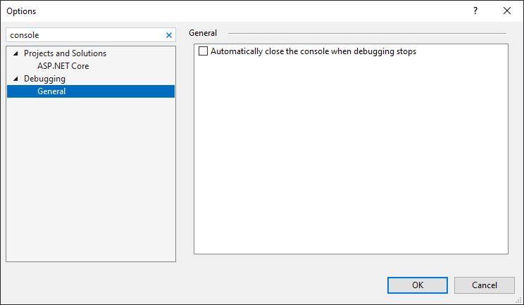

В последующих примерах вы увидите, как эта техника используется много раз. Теперь, когда вы создали проект, вы можете более подробно рассмотреть некоторые регионы среды разработки.

## Обозреватель решений
По умолчанию окно обозревателя решений закреплено в правом верхнем углу экрана. Как и другие окна, вы можете переместить его куда угодно или настроить автоматическое скрытие, щелкнув значок булавки. Окно Обозревателя решений делит пространство с другим полезным окном, называемым «Просмотр классов», которое можно отобразить с помощью команды «Вид ➪ Просмотр классов». На рис. показаны оба этих окна со всеми развернутыми узлами (вы можете переключаться между ними, щелкая вкладки в нижней части окна, когда окно закреплено).
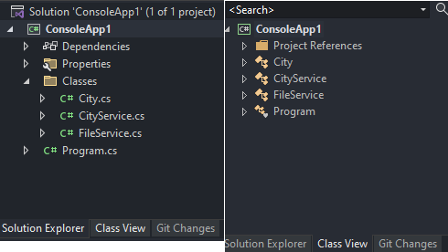

В этом представлении обозревателя решений показаны файлы, составляющие проект ConsoleApp1. Файл Program.cs, в который вы добавили код, отображается вместе с зависимостями проекта.

> ПРИМЕЧАНИЕ. Все файлы кода C# имеют расширение .cs.

Вы можете использовать это окно, чтобы изменить код, отображаемый в главном окне, дважды щелкнув файлы .cs; щелкнув их правой кнопкой мыши и выбрав «Просмотреть код»; или выделите их и нажмите кнопку на панели инструментов, которая появляется в верхней части окна. Здесь вы также можете выполнять другие операции с файлами, например переименовывать их или удалять из проекта. Здесь также могут отображаться другие типы файлов, например ресурсы проекта (ресурсы — это файлы, используемые проектом, которые могут не быть файлами C#, например растровые изображения и звуковые файлы). Опять же, вы можете манипулировать ими через один и тот же интерфейс.
Вы также можете развернуть элементы кода, такие как Program.cs, чтобы увидеть, что содержится. Этот обзор структуры вашего кода может оказаться очень полезным инструментом; он также позволяет вам переходить непосредственно к определенным частям вашего файла кода вместо того, чтобы открывать файл кода и прокручивать его до нужной части.
Запись «Зависимости» содержит список библиотек .NET, которые вы используете в своем проекте. Вы посмотрите на это позже; стандартные ссылки на данный момент подходят. Представление классов представляет собой альтернативное представление вашего проекта, показывая структуру созданного вами кода. Вы вернетесь к этому позже в книге; на данный момент подходит отображение обозревателя решений. Щелкая файлы или другие значки в этих окнах, обратите внимание, что содержимое окна «Свойства» (показанного на рис) меняется.

## Окно свойств
Окно «Свойства» (выберите «Вид» ➪ «Окно свойств», если оно еще не отображается) отображает дополнительную информацию обо всем, что вы выбираете в окне над ним. Например, представление, показанное на рисунке ниже, отображается, когда из проекта выбран файл Program.cs. В этом окне также отображается информация о других выбранных элементах, таких как компоненты пользовательского интерфейса (как показано в разделе «Настольные приложения» этой главы).
Часто изменения, вносимые вами в записи в окне «Свойства», напрямую влияют на ваш код, добавляя строки кода или изменяя содержимое ваших файлов. В некоторых проектах вы тратите столько же времени на управление вещами через это окно, сколько на внесение изменений в код вручную.

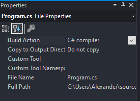

## Окно списка ошибок
В настоящее время окно списка ошибок (Вид ➪Список ошибок) не отображает ничего интересного, поскольку с приложением все в порядке. Однако это действительно особенно полезное окно. В качестве проверки удалите точку с запятой из одной из строк кода, добавленных вами в предыдущем разделе. Через некоторое время вы должны увидеть экран, подобный показанному на рисунке.

Кроме того, проект больше не будет компилироваться.

> ПРИМЕЧАНИЕ. Когда вы начнете изучать синтаксис C#, вы узнаете, что точки с запятой предполагаются во всем вашем коде — фактически в конце большинства строк.

Это окно помогает вам искоренить ошибки в коде, поскольку оно отслеживает, что вам необходимо сделать для компиляции проектов. Если дважды щелкнуть показанную здесь ошибку, курсор переместится на место ошибки в исходном коде (исходный файл, содержащий ошибку, будет открыт, если он еще не открыт), поэтому вы сможете быстро ее исправить. Красные волнистые линии появляются в местах ошибок в коде, поэтому вы можете быстро просмотреть исходный код, чтобы увидеть, где кроются проблемы.

Местоположение ошибки указывается в виде номера строки. По умолчанию номера строк не отображаются в текстовом редакторе Visual Studio, но эту возможность стоит включить. Для этого установите флажок «Номера строк» ​​в диалоговом окне «Параметры» (выбирается через пункт меню «Инструменты ➪ Параметры»). Он появится в категории «Текстовый редактор» ➪ «Все языки» ➪ «Общие».

Вы также можете изменить этот параметр для каждого языка на страницах настроек конкретного языка в диалоговом окне. В этом диалоговом окне можно найти множество других полезных опций, некоторые из них вы будете использовать далее в этой книге.

## Десктопное приложение

По аналогии создайте проект WPF приложения. В конструкторе из панели Toolbox перетащите Button и измените его свойство Content

Дважды щелкните на Button для создания обработчика событий. Измените открывшийся код следующим образом:
```cs
        private void Button_Click(object sender, RoutedEventArgs e)
        {
                MessageBox.Show("Ваш текст сообщения");
        }
```
 