# Лекция 2. PlantUML

## Часть 1: Введение в UML и PlantUML

### 1. Основы UML

**1.1. История и эволюция языка UML**

Unified Modeling Language (UML) представляет собой стандартный язык визуального моделирования, разработанный для создания моделей программного обеспечения и систем. UML был создан в середине 1990-х годов как ответ на потребность в унифицированном языке, который мог бы заменить множество различных нотаций, использовавшихся на тот момент в программной инженерии.

Изначально, в 1994 году, три ведущих специалиста в области объектно-ориентированного анализа и проектирования — Гради Буч (Grady Booch), Айвар Якобсон (Ivar Jacobson) и Джеймс Рамбо (James Rumbaugh) — начали работу над объединением своих методологий в единый язык. Эти методологии, известные как метод Буча, Object-Modeling Technique (OMT) Рамбо и Object-Oriented Software Engineering (OOSE) Якобсона, уже были широко распространены, но использовали разные нотации и подходы.

Результатом их работы стал первый черновик UML 0.9, который был представлен в 1996 году и позже передан в Object Management Group (OMG) — международную организацию, занимающуюся стандартизацией компьютерных технологий. В 1997 году был утвержден первый стандарт UML 1.0, который с тех пор претерпел несколько изменений и расширений, достигнув текущей версии UML 2.x.

Эволюция UML отражала изменения и потребности в индустрии программного обеспечения, включая:
- Переход от традиционных монолитных приложений к распределенным системам.
- Рост популярности объектно-ориентированного программирования и концепций, таких как инкапсуляция, полиморфизм и наследование.
- Повышение значимости Agile-методологий, которые требуют гибких и адаптируемых инструментов для моделирования.

**1.2. Роль UML в программной инженерии**

UML играет ключевую роль в программной инженерии, предоставляя разработчикам, аналитикам и проектировщикам универсальный инструмент для визуализации, спецификации, конструирования и документирования программных систем. Благодаря UML можно эффективно передавать сложные идеи и архитектурные решения различным участникам проекта, включая бизнес-аналитиков, инженеров и менеджеров.

Роль UML в программной инженерии можно охарактеризовать следующим образом:

1. **Средство визуализации**: UML позволяет создавать наглядные модели систем, что упрощает понимание и анализ как существующих, так и разрабатываемых систем. Модели, созданные с помощью UML, помогают выявить потенциальные проблемы на ранних этапах разработки.

2. **Спецификация и документация**: UML предоставляет формальные механизмы для спецификации структуры и поведения системы. Модели могут служить документацией, которая описывает архитектуру, процессы и взаимосвязи внутри системы. Это особенно важно для поддержания и эволюции крупных систем.

3. **Инструмент проектирования**: UML используется для создания детализированных моделей, которые могут служить основой для проектирования и реализации системы. Это снижает вероятность возникновения ошибок на этапе кодирования, так как проектировочные решения предварительно прорабатываются и визуализируются.

4. **Унификация языка общения**: UML стандартизирует способ представления системы, что упрощает коммуникацию между членами команды и заказчиком. Благодаря унифицированной нотации, все участники проекта могут оперировать одними и теми же понятиями и моделями.

**1.3. Краткий обзор типов UML-диаграмм**

UML включает в себя 14 основных типов диаграмм, которые можно разделить на две группы: **структурные диаграммы** и **диаграммы поведения**. Эти диаграммы описывают различные аспекты системы и используются на различных стадиях жизненного цикла разработки ПО.

**1.3.1. Структурные диаграммы**

Структурные диаграммы фокусируются на статической структуре системы, описывая элементы, из которых она состоит, и отношения между этими элементами. Основные виды структурных диаграмм включают:

1. **Диаграмма классов**:
   - Описывает классы системы, их атрибуты, методы и отношения между классами (наследование, ассоциации и т.д.).
   - **Пример**: В системе управления библиотекой может быть создана диаграмма классов, описывающая классы "Книга", "Читатель" и "Библиотекарь" с их атрибутами и методами, а также связь между ними (например, "Читатель" может "брать на абонемент" "Книгу").

2. **Диаграмма объектов**:
   - Представляет конкретные экземпляры классов (объекты) и их связи на определенный момент времени.
   - **Пример**: Для той же системы библиотеки диаграмма объектов может показать конкретный экземпляр книги (например, "Книга с названием '1984'") и связь с экземпляром класса "Читатель" (например, "Иван Иванов").

3. **Диаграмма компонентов**:
   - Показывает физические компоненты системы (модули, библиотеки) и их взаимосвязи.
   - **Пример**: Диаграмма компонентов может описывать структуру программного обеспечения, где один компонент отвечает за управление данными, а другой — за интерфейс пользователя.

4. **Диаграмма развертывания**:
   - Отображает физическое развертывание программных артефактов на узлах (серверы, компьютеры).
   - **Пример**: Для веб-приложения диаграмма развертывания может показать сервер баз данных, веб-сервер и клиентское приложение, а также связи между ними.

5. **Диаграмма пакетов**:
   - Демонстрирует, как классы и другие элементы UML сгруппированы в пакеты и отношения между ними.
   - **Пример**: В сложной системе может быть несколько пакетов, например, "UI", "Business Logic", "Data Access", где каждый пакет содержит свои классы и модули.

**1.3.2. Диаграммы поведения**

Диаграммы поведения описывают динамические аспекты системы, такие как потоки управления, взаимодействия между элементами и их состояния в процессе выполнения.

1. **Диаграмма последовательностей**:
   - Иллюстрирует взаимодействие объектов во временной последовательности, отображая обмен сообщениями между ними.
   - **Пример**: Для функции авторизации пользователя в системе диаграмма последовательностей может показать взаимодействие между пользователем, интерфейсом, сервером аутентификации и базой данных.

2. **Диаграмма активности**:
   - Показывает поток действий или операций внутри системы, включая условные ветвления и параллельные процессы.
   - **Пример**: Диаграмма активности может описывать процесс обработки заказа в интернет-магазине, включая этапы выбора товара, оформления заказа, оплаты и доставки.

3. **Диаграмма состояний**:
   - Описывает возможные состояния объекта в системе и переходы между этими состояниями в ответ на события.
   - **Пример**: В банковской системе объект "Счет" может находиться в состояниях "Активен", "Заблокирован", "Закрыт", и диаграмма состояний покажет возможные переходы между этими состояниями в ответ на события, такие как "Пополнение" или "Заморозка".

4. **Диаграмма использования (Use Case)**:
   - Моделирует взаимодействие акторов (внешних сущностей) с системой через прецеденты (Use Cases), которые представляют собой определенные функциональные требования.
   - **Пример**: Для системы управления курсами диаграмма использования может включать прецеденты "Регистрация студента", "Выбор курса" и "Просмотр оценок", а акторы будут представлять "Студента" и "Администратора".

5. **Диаграмма взаимодействия**:
   - Комбинирует элементы диаграмм последовательностей и диаграмм состояний для описания сложных взаимодействий в системе.
   - **Пример**: Может использоваться для моделирования взаимодействия между различными модулями системы в процессе выполнения сложного запроса.

6. **Диаграмма синхронизации**:
   - Подобна диаграмме последовательностей, но акцентирует внимание на синхронизации и параллелизме процессов.
   - **Пример**: Диаграмма может быть использована для моделирования синхронизации действий в многопоточной системе.

---

Таким образом, UML представляет собой мощный инструмент для моделирования как структурных, так и поведенческих аспектов программных систем. Важно отметить, что каждая диаграмма UML предназначена для выполнения определенной задачи, и их использование зависит от конкретных потребностей проекта и этапа разработки. Комбинируя различные типы диаграмм, можно создать всестороннюю модель системы, которая будет служить надежной основой для ее разработки и дальнейшей поддержки.

### 2. Обзор PlantUML

#### Что такое PlantUML и зачем он нужен

PlantUML — это инструмент для создания UML-диаграмм с использованием простого текстового описания. Он позволяет разработчикам и аналитикам быстро и эффективно создавать различные типы диаграмм, используя текстовые сценарии, которые затем автоматически преобразуются в графические изображения. Основная цель PlantUML — упростить процесс создания и поддержания UML-диаграмм, делая его более доступным и интегрируемым в процессы разработки программного обеспечения.

#### Преимущества использования PlantUML перед графическими редакторами

1. **Автоматизация**: PlantUML позволяет автоматизировать создание диаграмм, что значительно ускоряет процесс и уменьшает вероятность ошибок, связанных с ручным редактированием.
2. **Версионный контроль**: Текстовые файлы, используемые PlantUML, легко интегрируются с системами контроля версий (например, Git), что упрощает отслеживание изменений и совместную работу.
3. **Интеграция**: PlantUML можно интегрировать с различными инструментами разработки, такими как IDE (например, IntelliJ IDEA, Visual Studio Code), системы сборки (например, Maven, Gradle) и CI/CD системы (например, Jenkins).
4. **Расширяемость**: Благодаря открытой архитектуре, PlantUML поддерживает плагины и расширения, что позволяет добавлять новые возможности и типы диаграмм.
5. **Портативность**: Текстовые файлы PlantUML легко переносимы между различными системами и платформами, что упрощает совместную работу и обмен диаграммами.

#### Основные особенности и возможности PlantUML

- **Простота использования**: Синтаксис PlantUML интуитивно понятен и легко осваивается, что позволяет быстро начать работу с инструментом.
- **Широкий спектр поддерживаемых диаграмм**: PlantUML поддерживает множество типов UML-диаграмм, а также другие виды диаграмм, такие как диаграммы Ганта, диаграммы развертывания и т.д.
- **Гибкость настройки**: Пользователи могут настраивать внешний вид диаграмм, изменяя стили, цвета и шрифты.
- **Поддержка различных форматов вывода**: PlantUML может генерировать диаграммы в различных форматах, включая PNG, SVG, PDF и другие.
- **Интеграция с другими инструментами**: PlantUML легко интегрируется с различными инструментами и платформами, что делает его универсальным решением для создания диаграмм.

#### Поддерживаемые типы диаграмм

PlantUML поддерживает широкий спектр диаграмм, включая, но не ограничиваясь следующими:

1. **Классовые диаграммы**:
   ```plantuml
   @startuml
   class Person {
       -String name
       -int age
       +void walk()
       +void talk()
   }
   @enduml
   ```
   *Пример классовой диаграммы, описывающей класс Person с атрибутами и методами.*

2. **Диаграммы последовательностей**:
   ```plantuml
   @startuml
   Alice -> Bob: Hello Bob, how are you?
   Bob --> Alice: I am good, thanks!
   @enduml
   ```
   *Пример диаграммы последовательностей, показывающей взаимодействие между Alice и Bob.*

3. **Диаграммы состояний**:
   ```plantuml
   @startuml
   [*] --> State1
   State1 --> State2 : Event1
   State2 --> [*]
   @enduml
   ```
   *Пример диаграммы состояний, описывающей переходы между состояниями.*

4. **Диаграммы развертывания**:
   ```plantuml
   @startuml
   node "Web Server" {
       [Web Application]
   }
   node "Database Server" {
       [Database]
   }
   [Web Application] --> [Database]
   @enduml
   ```
   *Пример диаграммы развертывания, показывающей взаимодействие между веб-сервером и сервером базы данных.*

5. **Диаграммы компонентов**:
   ```plantuml
   @startuml
   [Component1] --> [Component2]
   [Component2] --> [Component3]
   @enduml
   ```
   *Пример диаграммы компонентов, демонстрирующей связи между компонентами.*

6. **Диаграммы случаев использования**:
   ```plantuml
   @startuml
   :User: --> (Login)
   :User: --> (Register)
   @enduml
   ```
   *Пример диаграммы случаев использования, показывающей взаимодействие пользователя с системой.*

---

PlantUML — это мощный и гибкий инструмент для создания UML-диаграмм, который предлагает множество преимуществ перед традиционными графическими редакторами. Благодаря простоте использования, поддержке различных типов диаграмм и возможности интеграции с другими инструментами, PlantUML становится незаменимым помощником для разработчиков и аналитиков в процессе проектирования и документирования программного обеспечения.

### 3. Установка и настройка PlantUML

#### Способы установки PlantUML

1. **Локальная установка**:
   - **Скачивание JAR-файла**:
     - Скачайте `plantuml.jar` с [официального сайта](http://plantuml.com/download).
     - Запустите с помощью команды:
       ```sh
       java -jar plantuml.jar yourfile.puml
       ```

2. **Онлайн-редакторы**:
   - **PlantText**: [PlantText](https://www.planttext.com/) — онлайн-редактор для создания и визуализации PlantUML-диаграмм.
   - **PlantUML QEditor**: [PlantUML QEditor](http://plantuml.com/qeditor) — еще один онлайн-редактор с поддержкой PlantUML.

3. **Плагины для IDE**:
   - **IntelliJ IDEA**:
     - Установите плагин "PlantUML integration" через `File > Settings > Plugins > Marketplace`.
   - **Visual Studio Code**:
     - Установите расширение "PlantUML" через `Extensions` (Ctrl+Shift+X) и найдите "PlantUML".

#### Зависимости и требования

1. **Java**:
   - PlantUML требует установленной Java Runtime Environment (JRE). Убедитесь, что у вас установлена Java версии 8 или выше.
   - Проверить версию Java можно командой:
     ```sh
     java -version
     ```

2. **Graphviz**:
   - Для генерации некоторых типов диаграмм (например, диаграмм классов) требуется Graphviz.
   - Установите Graphviz:
     - **Windows**: Скачайте и установите с [официального сайта](https://graphviz.gitlab.io/download/).
     - **macOS**: Используйте Homebrew:
       ```sh
       brew install graphviz
       ```
     - **Linux**: Установите через пакетный менеджер:
       ```sh
       sudo apt-get install graphviz
       ```

#### Интеграция с IDE

1. **IntelliJ IDEA**:
   - Установите плагин "PlantUML integration".
   - После установки плагина, создайте новый файл с расширением `.puml` и начните писать диаграммы.
   - Для визуализации диаграммы используйте сочетание клавиш `Alt + D` или откройте окно предпросмотра через `View > Tool Windows > PlantUML`.

2. **Visual Studio Code**:
   - Установите расширение "PlantUML".
   - Создайте новый файл с расширением `.puml`.
   - Для визуализации диаграммы используйте сочетание клавиш `Alt + D` или команду `PlantUML: Preview Current Diagram` из палитры команд (Ctrl+Shift+P).

### Пример использования PlantUML в Visual Studio Code

1. Установите расширение "PlantUML".
2. Создайте файл `example.puml` и добавьте следующий код:
   ```plantuml
   @startuml
   Alice -> Bob: Hello Bob, how are you?
   Bob --> Alice: I am good, thanks!
   @enduml
   ```
3. Нажмите `Alt + D` для просмотра диаграммы.

---

Установка и настройка PlantUML достаточно проста и может быть выполнена несколькими способами в зависимости от ваших предпочтений и рабочего окружения. Независимо от того, используете ли вы локальную установку, онлайн-редакторы или плагины для IDE, PlantUML предоставляет мощные инструменты для создания UML-диаграмм, которые легко интегрируются в ваш рабочий процесс.

## Часть 2: Основы работы с PlantUML

### 1. Основные концепции и синтаксис

#### Структура PlantUML-документа

PlantUML-документ состоит из текстового файла, который описывает диаграмму с использованием специального синтаксиса. Основные элементы структуры PlantUML-документа включают:

- **Начало и конец диаграммы**: Каждая диаграмма начинается с `@startuml` и заканчивается `@enduml`.
- **Описание элементов диаграммы**: Между `@startuml` и `@enduml` размещаются описания элементов диаграммы и их взаимодействий.

Пример базовой структуры PlantUML-документа:
```plantuml
@startuml
// Описание элементов диаграммы
@enduml
```

#### Основные ключевые слова и конструкции

PlantUML использует ключевые слова и конструкции для описания различных элементов UML-диаграмм. Рассмотрим основные из них:

1. **actor**: Представляет актера в диаграмме случаев использования.
2. **class**: Описывает класс в классовой диаграмме.
3. **interface**: Описывает интерфейс в классовой диаграмме.
4. **usecase**: Представляет случай использования в диаграмме случаев использования.
5. **note**: Добавляет заметку к элементу диаграммы.
6. **package**: Группирует элементы в пакеты.

#### Обзор основных команд

1. **actor**: Используется для обозначения актера в диаграмме случаев использования.
   ```plantuml
   @startuml
   actor User
   @enduml
   ```
   *Пример: Создание актера с именем User.*

2. **class**: Используется для создания класса в классовой диаграмме.
   ```plantuml
   @startuml
   class Person {
       -String name
       -int age
       +void walk()
       +void talk()
   }
   @enduml
   ```
   *Пример: Создание класса Person с атрибутами и методами.*

3. **interface**: Используется для создания интерфейса в классовой диаграмме.
   ```plantuml
   @startuml
   interface Walkable {
       +void walk()
   }
   @enduml
   ```
   *Пример: Создание интерфейса Walkable с методом walk().*

4. **usecase**: Используется для создания случая использования в диаграмме случаев использования.
   ```plantuml
   @startuml
   usecase "Login" as UC1
   @enduml
   ```
   *Пример: Создание случая использования с именем Login.*

5. **note**: Используется для добавления заметки к элементу диаграммы.
   ```plantuml
   @startuml
   class Person
   note right of Person : This is a person class
   @enduml
   ```
   *Пример: Добавление заметки к классу Person.*

6. **package**: Используется для группировки элементов в пакеты.
   ```plantuml
   @startuml
   package "User Management" {
       class User
       class Admin
   }
   @enduml
   ```
   *Пример: Группировка классов User и Admin в пакет User Management.*

#### Понятие простого и расширенного синтаксиса

PlantUML поддерживает два уровня синтаксиса: простой и расширенный.

1. **Простой синтаксис**: Используется для создания базовых диаграмм с минимальными усилиями. Он интуитивно понятен и легко осваивается.
   ```plantuml
   @startuml
   Alice -> Bob: Hello
   @enduml
   ```
   *Пример: Простая диаграмма последовательностей, показывающая взаимодействие между Alice и Bob.*

2. **Расширенный синтаксис**: Предоставляет больше возможностей для настройки и детализации диаграмм. Он включает в себя использование стилей, цветов, шрифтов и других параметров.
   ```plantuml
   @startuml
   skinparam class {
       BackgroundColor LightBlue
       BorderColor Blue
       ArrowColor Red
   }
   class Person {
       -String name
       -int age
       +void walk()
       +void talk()
   }
   @enduml
   ```
   *Пример: Классовая диаграмма с использованием расширенного синтаксиса для настройки стилей.*
---

PlantUML предоставляет мощный и гибкий синтаксис для создания UML-диаграмм. Основные концепции и ключевые слова позволяют легко описывать различные элементы диаграмм, а поддержка простого и расширенного синтаксиса делает PlantUML универсальным инструментом для проектирования и документирования программного обеспечения.

### 2. Создание базовых диаграмм

#### Диаграмма классов

Диаграмма классов является одним из основных инструментов для моделирования структуры системы. Она позволяет определить классы, их атрибуты и методы, а также отношения между классами.

##### Определение классов, их атрибутов и методов

Класс в PlantUML определяется с помощью ключевого слова `class`, за которым следует имя класса. Атрибуты и методы класса указываются внутри фигурных скобок `{}`.

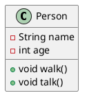
*Пример: Класс `Person` с атрибутами `name` и `age`, а также методами `walk` и `talk`.*

##### Отношения между классами

Отношения между классами включают наследование, ассоциацию, агрегацию и композицию.

1. **Наследование**: Используется для обозначения иерархии классов, где один класс наследует свойства и методы другого класса.
   ```plantuml
   @startuml
   class Person
   class Employee extends Person
   @enduml
   ```
   *Пример: Класс `Employee` наследует от класса `Person`.*

2. **Ассоциация**: Обозначает связь между двумя классами, где один класс использует другой.
   ```plantuml
   @startuml
   class Person
   class Car
   Person --> Car : owns
   @enduml
   ```
   *Пример: Класс `Person` ассоциирован с классом `Car` через отношение "владеет".*

3. **Агрегация**: Специальный вид ассоциации, где один класс содержит другой как часть целого, но при этом части могут существовать независимо.
   ```plantuml
   @startuml
   class Team
   class Player
   Team o-- Player : has
   @enduml
   ```
   *Пример: Класс `Team` агрегирует класс `Player`.*

4. **Композиция**: Более сильная форма агрегации, где части не могут существовать независимо от целого.
   ```plantuml
   @startuml
   class House
   class Room
   House *-- Room : contains
   @enduml
   ```
   *Пример: Класс `House` композитно содержит класс `Room`.*

#### Диаграмма последовательностей

Диаграмма последовательностей используется для описания взаимодействий между участниками системы через обмен сообщениями.

##### Описание участников и сообщений между ними

Участники диаграммы последовательностей определяются с помощью ключевых слов `participant`, `actor`, `boundary`, `control`, `entity` и `database`.

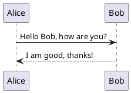
*Пример: Взаимодействие между участниками `Alice` и `Bob`.*

##### Создание различных типов сообщений

1. **Синхронные сообщения**: Обозначаются сплошной стрелкой с заполненной головой.
   ```plantuml
   @startuml
   Alice -> Bob: Synchronous call
   @enduml
   ```
   *Пример: Синхронное сообщение от `Alice` к `Bob`.*

2. **Асинхронные сообщения**: Обозначаются сплошной стрелкой с незаполненной головой.
   ```plantuml
   @startuml
   Alice ->> Bob: Asynchronous call
   @enduml
   ```
   *Пример: Асинхронное сообщение от `Alice` к `Bob`.*

##### Работа с условными операторами и циклами

1. **Условные операторы**: Используются для описания ветвлений в последовательности сообщений.
   ```plantuml
   @startuml
   Alice -> Bob: Hello
   alt is friend
       Bob -> Alice: Hi!
   else is not friend
       Bob -> Alice: Who are you?
   end
   @enduml
   ```
   *Пример: Условный оператор, определяющий разные ответы `Bob` в зависимости от условия.*

2. **Циклы**: Используются для описания повторяющихся действий.
   ```plantuml
   @startuml
   loop 10 times
       Alice -> Bob: Ping
       Bob --> Alice: Pong
   end
   @enduml
   ```
   *Пример: Цикл, повторяющий обмен сообщениями `Ping` и `Pong` 10 раз.*

#### Диаграмма прецедентов (Use Case)

Диаграмма прецедентов используется для описания взаимодействий акторов с системой через случаи использования.

##### Описание акторов и их взаимодействия с системой

Акторы и случаи использования определяются с помощью ключевых слов `actor` и `usecase`.

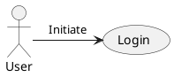
*Пример: Актор `User` инициирует случай использования `Login`.*

##### Связи между прецедентами

1. **extends**: Используется для обозначения расширения одного случая использования другим.
   ```plantuml
   @startuml
   usecase "Base Use Case" as UC1
   usecase "Extended Use Case" as UC2
   UC2 -|> UC1 : extends
   @enduml
   ```
   *Пример: Случай использования `Extended Use Case` расширяет `Base Use Case`.*

2. **includes**: Используется для обозначения включения одного случая использования в другой.
   ```plantuml
   @startuml
   usecase "Main Use Case" as UC1
   usecase "Included Use Case" as UC2
   UC1 --> UC2 : includes
   @enduml
   ```
   *Пример: Случай использования `Main Use Case` включает `Included Use Case`.*

---

Создание базовых диаграмм с помощью PlantUML позволяет эффективно моделировать различные аспекты системы. Диаграммы классов помогают определить структуру системы, диаграммы последовательностей описывают взаимодействия между участниками, а диаграммы прецедентов показывают, как акторы взаимодействуют с системой. Использование различных типов отношений и сообщений, а также условных операторов и циклов, позволяет создавать подробные и точные модели.

### 3. Расширенные возможности UML диаграмм

#### 1. Использование тем и стилей

##### Настройка внешнего вида диаграмм

Темы и стили позволяют настраивать визуальное представление диаграмм, что делает их более понятными и эстетически привлекательными. В PlantUML можно использовать встроенные темы или создавать собственные.

**Пример настройки темы:**

```plantuml
@startuml
skinparam backgroundColor #F0F0F0
skinparam class {
    BackgroundColor #FFFFFF
    BorderColor #000000
    FontColor #333333
}
class Person {
    -String name
    -int age
}
@enduml
```

*В этом примере мы изменили цвет фона диаграммы и настроили цвета для классов, что улучшает читаемость.*

##### Применение кастомных стилей

Кастомные стили позволяют задавать уникальные параметры для различных элементов диаграммы. Это может включать шрифты, размеры, цвета и другие визуальные атрибуты.

**Пример кастомного стиля:**

```plantuml
@startuml
skinparam class {
    BackgroundColor #E0E0E0
    BorderColor #007ACC
    FontColor #000000
    FontSize 14
}
class Car {
    +String model
    +int year
}
@enduml
```

*В этом примере мы применили кастомный стиль к классу `Car`, изменив его визуальные параметры.*

#### 2. Работа с пакетами

##### Объединение элементов в пакеты

Пакеты позволяют группировать связанные элементы, что упрощает организацию диаграмм и улучшает их читаемость. Пакеты могут содержать классы, интерфейсы и другие пакеты.

**Пример объединения элементов в пакеты:**

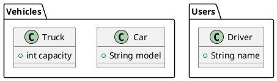

*В этом примере классы `Car` и `Truck` объединены в пакет `Vehicles`, а класс `Driver` находится в пакете `Users`.*

##### Визуализация иерархии модулей

Иерархия модулей может быть визуализирована с помощью вложенных пакетов, что позволяет лучше понять структуру системы.

**Пример визуализации иерархии:**

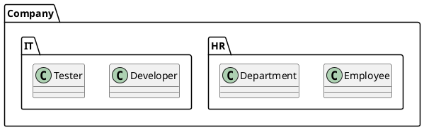

*В этом примере мы создали иерархию пакетов, где `HR` и `IT` являются подмодулями пакета `Company`.*

#### 3. Аннотации и комментарии

##### Добавление комментариев и аннотаций для пояснения диаграмм

Аннотации и комментарии помогают объяснить элементы диаграммы, что делает их более понятными для других участников проекта. В PlantUML можно добавлять текстовые аннотации и комментарии.

**Пример добавления аннотаций:**

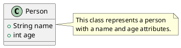

*В этом примере мы добавили аннотацию к классу `Person`, поясняющую его назначение.*

##### Использование комментариев для пояснения логики

Комментарии могут быть добавлены в код диаграммы для пояснения логики или структуры, что полезно для командной работы.

**Пример использования комментариев:**

```plantuml
@startuml
class Car {
    +String model
    +int year
}

// This class represents a car with model and year attributes.
class Engine {
    +int horsepower
}
@enduml
```

*В этом примере комментарий поясняет, что класс `Car` представляет собой автомобиль с атрибутами `model` и `year`.*

---

Расширенные возможности UML диаграмм, такие как использование тем и стилей, работа с пакетами и добавление аннотаций, значительно улучшают процесс моделирования. Эти инструменты позволяют создавать более организованные, понятные и визуально привлекательные диаграммы, что способствует лучшему пониманию системы и облегчает коммуникацию между участниками проекта.

## Часть 3: Практическое применение PlantUML

### 1. Интеграция PlantUML в процесс разработки

#### Примеры использования PlantUML в документации и проектировании ПО

PlantUML является мощным инструментом для создания UML-диаграмм, который может быть интегрирован в процесс разработки программного обеспечения. Он позволяет разработчикам визуализировать архитектуру системы, что способствует лучшему пониманию и документированию.

**Пример использования PlantUML в документации:**

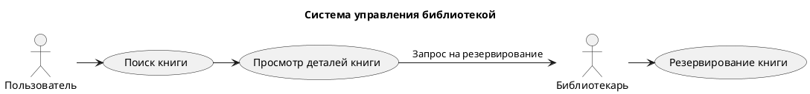

*В этом примере мы создали диаграмму прецедентов, которая показывает взаимодействие пользователей с системой управления библиотекой. Это помогает команде понять основные функции системы и их взаимосвязи.*

#### Генерация UML-диаграмм на основе существующего кода (на примере C# кода)

PlantUML может быть использован для автоматической генерации UML-диаграмм на основе существующего кода. Это позволяет разработчикам быстро визуализировать структуру кода и его компоненты.

**Пример генерации диаграммы классов из C# кода:**

```csharp
// Пример C# кода
public class Car {
    public string Model { get; set; }
    public int Year { get; set; }
}

public class Engine {
    public int Horsepower { get; set; }
}

// Генерация диаграммы классов
@startuml
class Car {
    +string Model
    +int Year
}

class Engine {
    +int Horsepower
}

Car --> Engine: has
@enduml
```

*В этом примере мы создали диаграмму классов, которая показывает связь между классами `Car` и `Engine`. Связь "has" указывает на то, что класс `Car` содержит экземпляр класса `Engine`.*

#### Создание диаграмм в CI/CD процессах (например, автоматическое генерирование документации)

Интеграция PlantUML в CI/CD процессы позволяет автоматизировать создание документации и диаграмм, что значительно упрощает процесс разработки и поддержания актуальности документации.

**Пример автоматического генерирования документации:**

1. **Настройка CI/CD**: Включите шаг в вашем CI/CD пайплайне, который будет запускать PlantUML для генерации диаграмм.

```yaml
# Пример конфигурации для GitHub Actions
name: Generate UML Diagrams

on:
  push:
    branches:
      - main

jobs:
  generate-diagrams:
    runs-on: ubuntu-latest
    steps:
      - name: Checkout code
        uses: actions/checkout@v2

      - name: Install PlantUML
        run: sudo apt-get install plantuml

      - name: Generate UML Diagrams
        run: plantuml diagrams/*.puml
```

*В этом примере мы настроили GitHub Actions для автоматической генерации UML-диаграмм при каждом пуше в ветку `main`. Все файлы с расширением `.puml` в папке `diagrams` будут обработаны PlantUML.*

2. **Создание документации**: После генерации диаграмм можно автоматически обновлять документацию, например, с помощью Sphinx или MkDocs.

```markdown
# Документация проекта

## Диаграммы


```

*В этом примере мы добавили ссылку на сгенерированную диаграмму классов в документацию проекта. Это позволяет команде всегда иметь доступ к актуальной информации о структуре системы.*

---

Интеграция PlantUML в процесс разработки программного обеспечения предоставляет множество преимуществ, включая улучшение документации, автоматизацию генерации диаграмм и упрощение визуализации кода. Эти практические применения способствуют повышению эффективности работы команды и улучшению качества разрабатываемого программного обеспечения.

### 2. Совместная работа над диаграммами

#### Обзор возможностей совместной работы над PlantUML-диаграммами в команде

Совместная работа над диаграммами является важным аспектом командной разработки, так как она позволяет участникам проекта обмениваться идеями, обсуждать архитектурные решения и визуализировать сложные системы. PlantUML предоставляет несколько возможностей для эффективного сотрудничества:

1. **Общий доступ к диаграммам**: PlantUML позволяет хранить диаграммы в текстовом формате, что упрощает их совместное редактирование. Команда может использовать системы управления версиями для отслеживания изменений и совместной работы над диаграммами.

2. **Комментирование и обсуждение**: Используя платформы, такие как GitHub, команда может оставлять комментарии к изменениям в диаграммах, что способствует более глубокому обсуждению и улучшению качества документации.

3. **Интеграция с инструментами для совместной работы**: PlantUML может быть интегрирован с различными инструментами, такими как Confluence или Notion, что позволяет командам легко встраивать диаграммы в свои рабочие процессы.

#### Примеры использования онлайн-инструментов (PlantText, WebSequenceDiagrams)

Онлайн-инструменты, такие как PlantText и WebSequenceDiagrams, предоставляют удобные интерфейсы для создания и редактирования PlantUML-диаграмм, что делает их идеальными для совместной работы.

**Пример использования PlantText:**

PlantText — это веб-приложение, которое позволяет пользователям создавать и редактировать PlantUML-диаграммы в реальном времени. Оно поддерживает совместное редактирование, что позволяет нескольким участникам работать над одной диаграммой одновременно.

1. **Создание диаграммы**: Пользователь может ввести код PlantUML в текстовом редакторе.

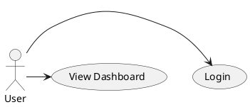

2. **Совместное редактирование**: Другие участники могут подключиться к той же сессии и вносить изменения, что позволяет команде обсуждать и дорабатывать диаграмму в реальном времени.

**Пример использования WebSequenceDiagrams:**

WebSequenceDiagrams — это еще один онлайн-инструмент, который позволяет создавать диаграммы последовательностей. Он также поддерживает совместное редактирование и предоставляет возможность экспортировать диаграммы в различные форматы.

1. **Создание диаграммы последовательностей**:

```plaintext
title User Login Sequence
User->WebApp: Request Login
WebApp->Database: Validate User
Database-->WebApp: User Validated
WebApp-->User: Show Dashboard
```

2. **Экспорт диаграммы**: После создания диаграммы пользователи могут экспортировать ее в формате PNG или SVG для дальнейшего использования в документации.

#### Интеграция с системами управления версиями (GitHub, GitHub Actions)

Интеграция PlantUML с системами управления версиями, такими как GitHub, позволяет командам эффективно управлять изменениями в диаграммах и поддерживать их актуальность.

1. **Хранение диаграмм в репозитории**: Команда может хранить файлы PlantUML в репозитории GitHub, что позволяет отслеживать изменения и управлять версиями диаграмм.

```plaintext
diagrams/
  ├── class_diagram.puml
  ├── sequence_diagram.puml
```

2. **Использование GitHub Actions для автоматизации**: GitHub Actions можно использовать для автоматической генерации диаграмм при каждом коммите. Это позволяет команде всегда иметь доступ к актуальным диаграммам.

```yaml
# Пример конфигурации для GitHub Actions
name: Generate UML Diagrams

on:
  push:
    branches:
      - main

jobs:
  generate-diagrams:
    runs-on: ubuntu-latest
    steps:
      - name: Checkout code
        uses: actions/checkout@v2

      - name: Install PlantUML
        run: sudo apt-get install plantuml

      - name: Generate UML Diagrams
        run: plantuml diagrams/*.puml
```

3. **Обсуждение изменений**: После генерации диаграмм команда может использовать Pull Requests для обсуждения изменений, что позволяет улучшить качество документации и архитектурных решений.

---

Совместная работа над PlantUML-диаграммами значительно улучшает процесс разработки программного обеспечения. Использование онлайн-инструментов, таких как PlantText и WebSequenceDiagrams, а также интеграция с системами управления версиями, такими как GitHub, позволяет командам эффективно сотрудничать, обсуждать и визуализировать архитектурные решения, что в конечном итоге приводит к повышению качества разрабатываемого программного обеспечения.

### 3. Практические примеры UML-диаграмм в разработке ПО

#### 1. Создание UML-диаграмм для реальных кейсов

##### 1.1 Диаграмма классов

**Пример: Система управления библиотекой**

Диаграмма классов представляет собой статическую структуру системы, показывающую классы, их атрибуты, методы и отношения между ними. Рассмотрим систему управления библиотекой, которая включает в себя классы `Book`, `Member`, `Loan`, и `Library`.

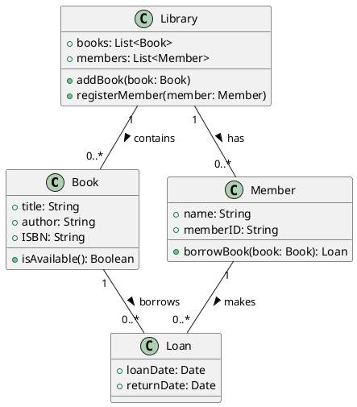

**Комментарии:**
- Класс `Book` содержит информацию о книге, включая название, автора и ISBN.
- Класс `Member` представляет пользователя библиотеки, который может брать книги.
- Класс `Loan` фиксирует информацию о займе книги.
- Класс `Library` управляет коллекцией книг и членов.

##### 1.2 Диаграмма прецедентов

**Пример: Система онлайн-заказа еды**

Диаграмма прецедентов (или диаграмма случаев использования) показывает взаимодействие пользователей с системой. Рассмотрим систему онлайн-заказа еды, где основные прецеденты включают `Browse Menu`, `Place Order`, и `Track Order`.

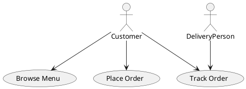

**Комментарии:**
- Актор `Customer` взаимодействует с системой для просмотра меню, размещения заказа и отслеживания статуса заказа.
- Актор `DeliveryPerson` также может отслеживать заказы, что показывает взаимодействие между различными ролями в системе.

##### 1.3 Диаграмма состояний

**Пример: Система управления заказами**

Диаграмма состояний описывает жизненный цикл объекта, показывая различные состояния и переходы между ними. Рассмотрим жизненный цикл заказа в системе управления заказами.

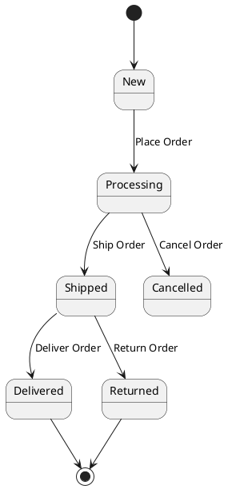

**Комментарии:**
- Заказ начинается в состоянии `New` и переходит в `Processing` при размещении.
- Заказ может быть отменен в любом состоянии до доставки.
- После доставки заказ может быть возвращен, что также фиксируется в диаграмме.

#### 2. Разбор и анализ созданных диаграмм

##### 2.1 Анализ диаграммы классов

Диаграмма классов для системы управления библиотекой демонстрирует четкую структуру и отношения между классами. Основные моменты анализа:

- **Атрибуты и методы**: Каждый класс имеет четко определенные атрибуты и методы, что упрощает понимание его функциональности.
- **Отношения**: Использование ассоциаций (например, `borrows`, `makes`, `contains`, `has`) показывает, как классы взаимодействуют друг с другом, что важно для проектирования базы данных и бизнес-логики.

##### 2.2 Анализ диаграммы прецедентов

Диаграмма прецедентов для системы онлайн-заказа еды позволяет понять, какие функции системы наиболее важны для пользователей. Основные моменты анализа:

- **Акторы**: Определение акторов помогает понять, кто будет взаимодействовать с системой и какие функции им необходимы.
- **Прецеденты**: Каждый прецедент описывает конкретную задачу, что позволяет команде сосредоточиться на реализации ключевых функций.

##### 2.3 Анализ диаграммы состояний

Диаграмма состояний для системы управления заказами показывает, как заказ проходит через различные этапы. Основные моменты анализа:

- **Состояния**: Четкое определение состояний помогает разработчикам понять, как обрабатывать заказы на каждом этапе.
- **Переходы**: Переходы между состояниями показывают возможные действия пользователей и системы, что важно для реализации бизнес-логики.

---

Создание и анализ UML-диаграмм, таких как диаграммы классов, прецедентов и состояний, является важным этапом в разработке программного обеспечения. Эти диаграммы помогают командам визуализировать структуру, функциональность и динамику системы, что в конечном итоге способствует более качественному проектированию и реализации программных решений.

## Заключение
### Основные выводы и ключевые моменты лекции

1. **Важность UML**: UML-диаграммы (Unified Modeling Language) являются мощным инструментом для визуализации, спецификации, конструирования и документирования программных систем. Они помогают командам лучше понять структуру и поведение системы.

2. **Анализ диаграмм**: Каждая диаграмма предоставляет уникальную перспективу на систему, позволяя командам выявлять ключевые аспекты проектирования и реализации.

3. **Улучшение качества разработки**: Использование UML-диаграмм способствует более качественному проектированию, снижению ошибок и улучшению коммуникации в команде.

### Преимущества и возможности PlantUML

1. **Простота использования**: PlantUML позволяет создавать диаграммы с помощью простого текстового синтаксиса, что делает его доступным для разработчиков без необходимости в графических редакторах.

2. **Гибкость**: Поддерживает множество типов диаграмм, включая классы, прецеденты, состояния, последовательности и другие, что позволяет моделировать различные аспекты системы.

3. **Интеграция**: PlantUML легко интегрируется с различными инструментами разработки, такими как IDE (например, IntelliJ IDEA, Eclipse) и системы управления версиями (например, Git), что упрощает процесс документирования.

4. **Автоматизация**: Возможность генерации диаграмм из текстовых описаний позволяет автоматизировать процесс обновления документации, что особенно полезно в Agile-средах.

5. **Поддержка различных форматов**: PlantUML может экспортировать диаграммы в различные форматы, такие как PNG, SVG и PDF, что делает их удобными для использования в документации и презентациях.

6. **Сообщество и поддержка**: PlantUML имеет активное сообщество, что обеспечивает доступ к множеству ресурсов, примеров и поддержки.

Эти преимущества делают PlantUML мощным инструментом для разработчиков и команд, стремящихся улучшить процесс проектирования и документирования программных систем.